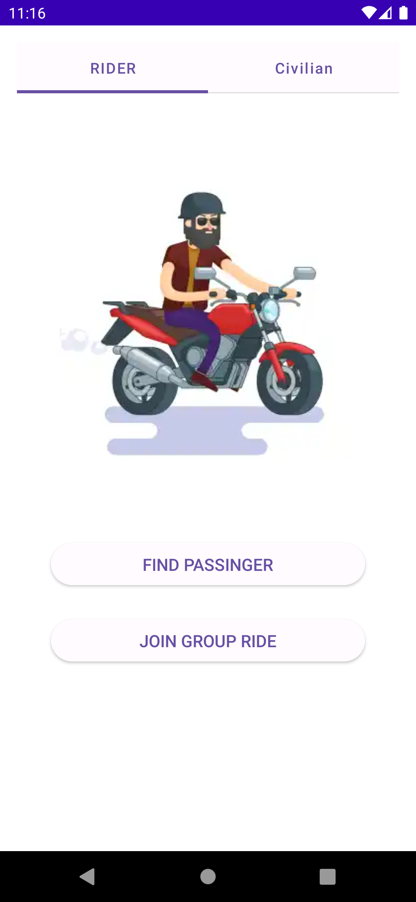

### PROJECT
The application idea is to connect motorcyclists to organize group rides and community activities. 
And also help bikers and passingers find each other to ride and travel togeather.

I have created this project to practice some technologies and approaches. It may serve Demo purposes as well.
Application is still in W.I.P state. Here's what we have so far.

### INSPIRATION
Some approaches and solutions were inspired by [Now In Android] project

### BUILDS
Project is based on Gradle Convention Builds & Version Catalog

### DI
Project uses HILT for DI

### MODULARIZATION
Project uses App, Feature, Library modules

### UI
Project uses Jetpack Compose with ViewModel (and Coroutines StateFlow to transfer a state).

### STORAGE
Project uses Room and Jetpack DataStore to persist data

### TEST
JUnit, Mockito, Robolectric

### CI/CD
Check out pipelines on [GitLab CI]

[Now In Android]: <https://github.com/android/nowinandroid>
[GitLab CI]: <https://gitlab.com/Sborets/lets-ride/-/pipelines>
